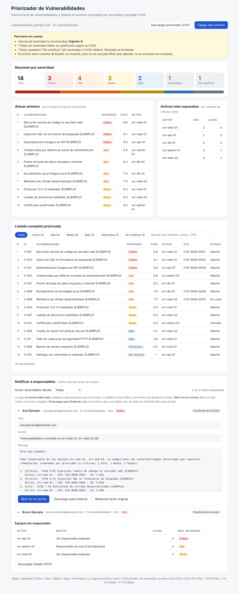
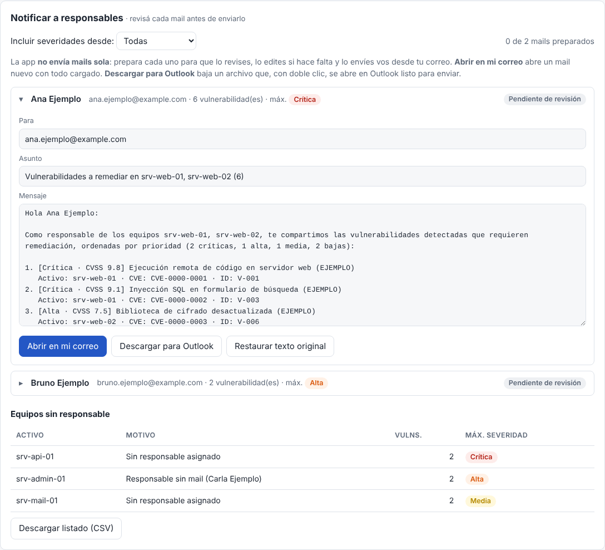

# Priorizador de Vulnerabilidades

App web simple: subís el Excel de vulnerabilidades y te devuelve, en una sola pantalla, el resumen priorizado por severidad y puntaje CVSS.



## Qué muestra

- **Resumen por severidad:** totales de Crítica, Alta, Media, Baja e Informativa.
- **Atacar primero:** las 10 vulnerabilidades más prioritarias.
- **Activos más expuestos:** los hosts con más vulnerabilidades críticas y altas (si el Excel trae la columna de activo).
- **Listado completo priorizado:** con filtros por severidad y buscador.
- **Descarga en CSV** del listado ya priorizado.
- **Avisos** cuando el archivo tiene datos incompletos o valores que no reconoce.
- **Notificar a responsables:** prepara un mail por responsable con sus vulnerabilidades, para que el operador lo revise, lo edite y lo envíe.
- **Equipos sin responsable:** listado (descargable en CSV) de los equipos sin responsable o sin mail.

## Cómo usarla

1. Abrí la app (ver "Publicación" más abajo, o abrí `index.html` con doble clic).
2. Arrastrá el Excel o hacé clic para elegirlo (`.xlsx` o `.csv`). Se lee **la primera hoja**.
3. Listo. Para probarla, usá `ejemplos/vulnerabilidades_ejemplo.xlsx`.

**Privacidad:** el archivo se procesa completamente en el navegador. No se envía a ningún servidor y la app no necesita internet.

## Formato del Excel

La primera fila con datos se toma como encabezado. Los nombres de columna se reconocen sin importar mayúsculas ni tildes, en español o en inglés.

| Columna | ¿Obligatoria? | Nombres reconocidos |
|---|---|---|
| Vulnerabilidad | Sí | Vulnerabilidad, Título, Nombre, Title, Name, Plugin Name |
| Severidad | Sí, o CVSS | Severidad, Riesgo, Nivel, Severity, Risk |
| CVSS | Sí, o Severidad | CVSS, CVSS Score, CVSS Base Score, Puntaje, Score |
| Activo | No | Activo, Host, Servidor, Equipo, Asset, IP, Hostname |
| ID | No | ID, Código, Plugin ID, QID |
| CVE | No | CVE, CVEs, CVE ID |
| Estado | No | Estado, Status |

Valores de severidad reconocidos: Crítica, Alta, Media, Baja, Informativa y sus equivalentes en inglés (Critical, High, Medium, Low, Info/None).

### Responsables (opcional)

Para preparar los mails, el Excel puede tener una hoja llamada **Responsables** (o cualquier nombre que contenga "responsable" u "owner"), con una fila por equipo:

| Activo | Responsable | Email |
|---|---|---|
| srv-web-01 | Ana Ejemplo | ana.ejemplo@example.com |

- El **Activo** tiene que escribirse igual que en la hoja de vulnerabilidades (no importan mayúsculas ni tildes).
- También se pueden poner columnas **Responsable** y **Email** directamente en la primera hoja. Si están, tienen prioridad sobre la hoja Responsables.
- Nombres de columna reconocidos: Responsable, Owner, Dueño, Encargado, Referente / Email, Mail, Correo, E-mail.

Hay una plantilla vacía en `ejemplos/plantilla_vulnerabilidades.xlsx`.

Para agregar otros nombres de columna, editá el bloque `COLUMNAS` al principio del `<script>` en `index.html`.

## Regla de priorización

1. Se ordena por **severidad**: Crítica > Alta > Media > Baja > Informativa > Sin clasificar.
2. A igual severidad, va primero la de **mayor CVSS**.
3. A igual severidad y CVSS, se mantiene el orden del archivo.
4. Si una fila no tiene severidad válida pero sí CVSS, la severidad se calcula con los rangos de CVSS v3: 9.0–10 Crítica, 7.0–8.9 Alta, 4.0–6.9 Media, 0.1–3.9 Baja y 0 Informativa.
5. Si no tiene ni severidad ni CVSS, queda como **Sin clasificar** y se avisa en pantalla.

## Notificar a responsables



1. La app agrupa las vulnerabilidades por responsable: **un mail por persona**, con todas sus vulnerabilidades ordenadas por prioridad.
2. Con **"Incluir severidades desde"** se elige qué se notifica (por ejemplo, solo Alta o mayor). Al cambiarlo, los mails se regeneran.
3. El operador **revisa y puede editar** el asunto y el texto de cada mail. "Restaurar texto original" deshace los cambios.
4. Para enviar:
   - **Abrir en mi correo:** abre un mail nuevo en el programa de correo predeterminado, con destinatario, asunto y texto cargados. Algunos programas cortan los mails muy largos; en ese caso, usar la otra opción.
   - **Descargar para Outlook:** baja un archivo `.eml` que, con doble clic, se abre en Outlook como mail nuevo listo para enviar.
5. Cada mail preparado queda marcado como **"Preparado ✓"**, con un contador arriba.
6. **Equipos sin responsable:** lista los equipos que no se pudieron notificar y el motivo (sin responsable, responsable sin mail, mail inválido o vulnerabilidad sin activo). Se puede descargar en CSV.

**La app no envía mails por sí sola.** El envío siempre lo confirma el operador desde su correo. Enviar automáticamente o tomar los mails de los contactos de Outlook requeriría una integración con Microsoft 365 (Microsoft Graph) autorizada por IT; queda como posible evolución.

## Publicación en GitHub Pages

1. En GitHub: **New repository**, con un nombre como `priorizador-vulnerabilidades`.
2. **Add file → Upload files** y arrastrá **todo el contenido** de esta carpeta (incluyendo `lib/`, `ejemplos/` y `docs/`). Después, **Commit changes**.
3. **Settings → Pages**. En "Build and deployment", elegí *Deploy from a branch*, branch `main`, carpeta `/ (root)`, y **Save**.
4. En uno o dos minutos la app queda publicada en `https://<usuario-u-organización>.github.io/priorizador-vulnerabilidades/`.

> Si el repo es privado, GitHub Pages depende del plan de la organización. Confirmalo con quien administra GitHub en Flock.

## Estructura

```
index.html                  La app completa (HTML, estilos y lógica)
lib/exceljs.min.js          Librería para leer Excel (ExcelJS 4.4.0, licencia MIT)
lib/EXCELJS-LICENSE         Licencia de ExcelJS
ejemplos/                   Excel de ejemplo (datos ficticios, mails @example.com) y plantilla vacía
docs/                       Capturas para este README
skill/SKILL.md              Copia de la skill de Claude que aplica la misma regla
```

## Skill de Claude

En `skill/SKILL.md` hay una copia de la skill **priorizar-vulnerabilidades**. Con ella, Claude aplica la misma regla de priorización cuando se le comparte un Excel en una conversación: entrega un resumen, un Excel priorizado y los borradores de mail para cada responsable.

- La skill **vive en la cuenta de Claude** de cada persona, no en este repo. Este archivo es solo una copia de referencia.
- **Editar este archivo no cambia la skill.** Para modificarla, hay que pedírselo a Claude y guardar la versión nueva desde la tarjeta que propone.
- Para usarla, cada persona tiene que guardarla en su cuenta de Claude, o el administrador de Claude en Flock puede compartirla con la organización, si está habilitado.

## Decisiones técnicas

- **Sin servidor:** es un único HTML estático. Es simple de publicar y mantener, y los datos sensibles no salen de la máquina del usuario.
- **ExcelJS incluida en el repo** (no se carga desde internet): funciona en redes corporativas que bloquean CDNs y evita depender de un tercero en tiempo de ejecución.
- **No se usa SheetJS (`xlsx`) desde npm:** la versión publicada ahí (0.18.5) tiene vulnerabilidades conocidas al leer archivos manipulados (CVE-2023-30533 y CVE-2024-22363).
- **`npm audit` sobre ExcelJS 4.4.0** reporta un aviso moderado en su dependencia `uuid` (GHSA-w5hq-g745-h8pq). Afecta a la generación de UUIDs con un buffer provisto, una función que esta app no usa para leer archivos. Conviene que lo valide el equipo de seguridad.
- El contenido del Excel se muestra siempre como texto, nunca se interpreta como HTML. Se probó con un archivo que contenía código malicioso y no se ejecutó.
- **Soporta `.xlsx` y `.csv`.** El formato antiguo `.xls` no está soportado: hay que guardarlo como `.xlsx`.

## Pendientes a validar

- [ ] **Formato real del Excel:** las columnas se definieron sin un archivo real. Hay que probar con una exportación verdadera de la herramienta de escaneo que use el equipo.
- [ ] **Impacto de negocio:** el enunciado pide priorizar por "severidad e impacto". Hoy se usa severidad y CVSS (el CVSS ya incluye impacto técnico en confidencialidad, integridad y disponibilidad), pero no la criticidad del activo para el negocio. Hay que confirmar si alcanza.
- [ ] **Vulnerabilidades cerradas:** hoy se muestran todas. Hay que definir si las que estén "Cerradas" o "Resueltas" se excluyen.
- [ ] **Severidad numérica:** algunas herramientas usan escalas de 1 a 5 (por ejemplo, Qualys). No se mapearon para no asumir una equivalencia; si el archivo real las usa, hay que definir la tabla de conversión.
- [ ] **Hosting:** confirmar si GitHub Pages está permitido en la organización.
- [ ] **Fuente de responsables:** hoy se cargan en el Excel. Hay que definir si existe un inventario oficial (CMDB, SharePoint) de donde tomarlos.
- [ ] **Texto del mail:** el texto es genérico. Hay que validar con seguridad el tono, el plazo de remediación esperado y la firma.
